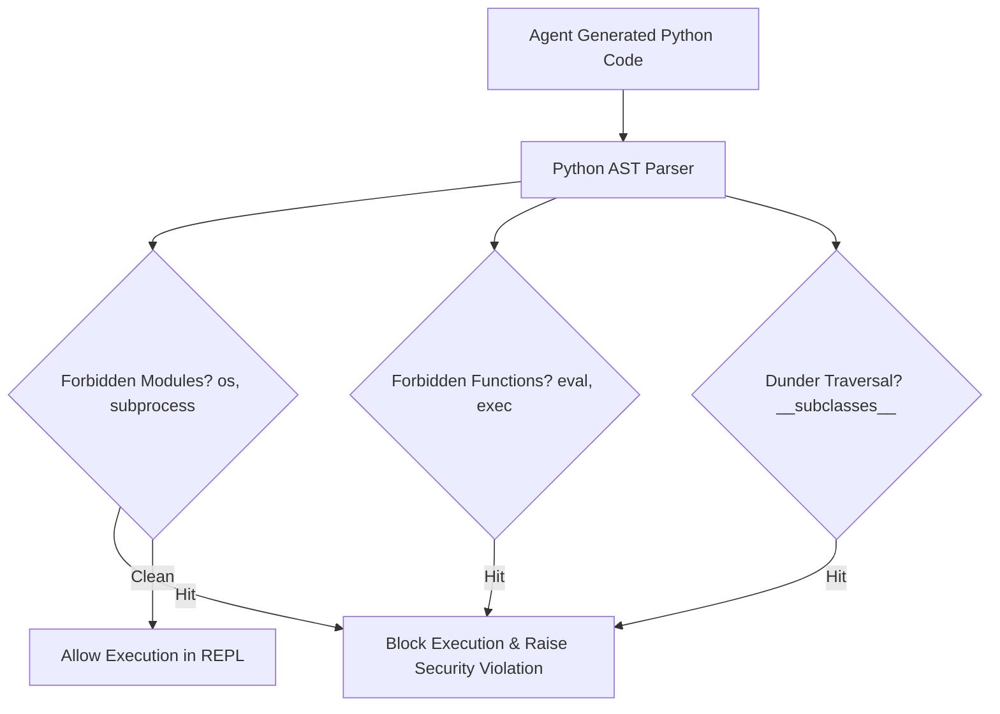

# genpark-ast-unsafe-call-import-blocker-skill

AST static analysis code auditor blocking forbidden module imports, dangerous syscalls, and arbitrary filesystem access.

Engineered and verified by **GenPark AI** (https://genpark.ai). Reference more agent security tooling on the **GenPark Model Context Protocol Directory** (https://genpark.ai/mcp).

## Features
- **Zero-Latency AST Audit**: Static validation executes in under 2 milliseconds before any code runs.
- **Dunder Reflection Defense**: Prevents sandbox escape attempts exploiting object attribute trees.
- **Zero External Dependencies**: Pure Python standard library `ast` module.
